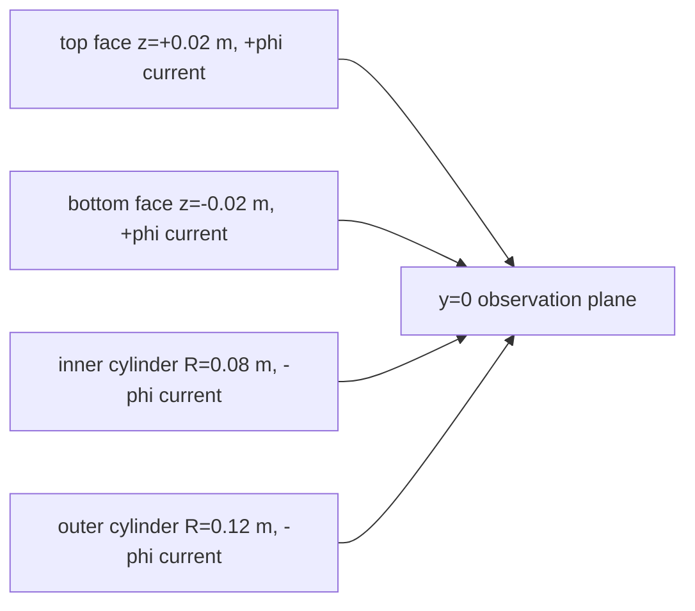

# square_toroid

A square-cross-section toroidal magnet modeled as four toroidal current
sheets. The top and bottom faces carry current in the `+phi` direction; the
inner and outer cylindrical faces carry current in the `-phi` direction.

The example uses `R0 = 0.10 m`, square side `a = 0.04 m`, and `1 A` total
current per sheet. Each sheet is represented by 16 thin circular filaments, so
the full model contains 64 circular loops and 16 384 straight Biot-Savart
segments after discretization.

## Run

From the repository root, with the build-tree Python package on `PYTHONPATH`:

```bash
PYTHONPATH=build/hip-gfx942-release/python \
  python -m quasar.coil.cli run examples/square_toroid/input.yaml
```

The output is written next to `input.yaml` as `out.npz`. Keys:

- `B_xyz` - `(11041, 3)` flat array of magnetic flux density in tesla.
- `B_magnitude` - `(11041,)` array, `|B|` per observation point.
- `dims` - `(2,)` array `[181, 61]` for the meridional plane.
- `observation_kind` - string `"plane"`.

## Geometry

The square cross-section spans:

- inner radius `R_in = 0.08 m`
- outer radius `R_out = 0.12 m`
- bottom face `z = -0.02 m`
- top face `z = +0.02 m`



With `axis_xyz = [0, 0, 1]`, positive current in a `circular_loop` follows
`+phi` by the right-hand rule. The deck therefore uses positive current for
the top and bottom sheet filaments and negative current for the inner and
outer cylindrical sheet filaments.

The deck is generated by:

```bash
python examples/square_toroid/build_yaml.py
```

## Expected field structure

The geometry is axisymmetric, so there is no toroidal field component. In the
`y = 0` observation plane, that means `B_y` should be zero to roundoff and the
visible field is the poloidal vector field `(B_x, B_z)`.

Additional symmetry checks:

- `B_x = 0` on the z-axis (`x = 0` in the plane slice).
- `B_x = 0` on the mid-plane (`z = 0`) by mirror symmetry.
- `|B|` is on the order of `1e-5 T` near the bore for this 1 A lab-scale setup.

The top and bottom sheets behave like two pancake coils and contribute a
positive `B_z` near the center. The inner and outer cylindrical sheets behave
like short nested solenoids with the opposite sign and partially cancel that
field.

## Plotting

```python
from pathlib import Path

import matplotlib.pyplot as plt
import numpy as np

from quasar.coil.postprocess import magnitude

path = Path("examples/square_toroid/out.npz")
archive = np.load(path, allow_pickle=False)

nu, nv = archive["dims"]
B = archive["B_xyz"].reshape((nv, nu, 3))
Bmag = magnitude(B)

x = np.linspace(-0.18, 0.18, int(nu))
z = np.linspace(-0.06, 0.06, int(nv))
X, Z = np.meshgrid(x, z)

fig, ax = plt.subplots()
img = ax.imshow(
    Bmag,
    origin="lower",
    aspect="auto",
    extent=[x.min(), x.max(), z.min(), z.max()],
)
fig.colorbar(img, ax=ax, label="|B| (T)")

stride = 5
ax.quiver(
    X[::stride, ::stride],
    Z[::stride, ::stride],
    B[::stride, ::stride, 0],
    B[::stride, ::stride, 2],
    color="white",
    scale=3e-4,
)

ax.plot([0.08, 0.12, 0.12, 0.08, 0.08],
        [-0.02, -0.02, 0.02, 0.02, -0.02],
        color="black")
ax.plot([-0.08, -0.12, -0.12, -0.08, -0.08],
        [-0.02, -0.02, 0.02, 0.02, -0.02],
        color="black")
ax.set_xlabel("x (m)")
ax.set_ylabel("z (m)")
ax.set_title("Square toroid current-sheet approximation")
plt.show()
```
