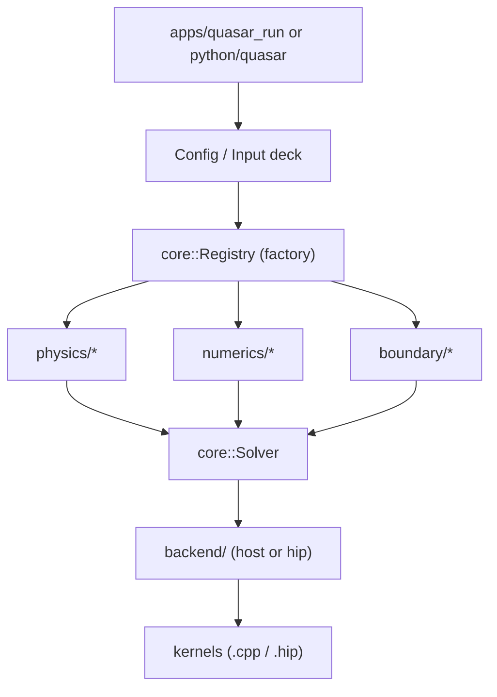

# Quasar — Directory Layout Plan

Modular monorepo layout for a C++/HIP/Python numerical simulation framework where physics models, numerical schemes, boundary conditions, and execution backends are independent, pluggable modules composed through abstract interfaces and a runtime registry.

## Design principles

1. **Four orthogonal axes** — `physics × numerics × boundary × backend`. Each lives in its own directory tree under both `include/quasar/<axis>/` (interfaces) and `src/<axis>/` (implementations). Adding a new scheme never touches the others.
2. **Backend isolation** — all HIP code is confined to `src/backend/hip/`. The rest of the codebase only sees an abstract `ExecutionPolicy` / `MemorySpace` / kernel-launch wrapper. Swapping CPU↔GPU is a build/runtime flag, not a rewrite.
3. **Plugin registry** — every concrete scheme/BC/physics self-registers via a small factory in `core/registry.hpp`, so the input deck (YAML/JSON/Python) can pick implementations by string name with no `if/else` chains in the driver.
4. **Public vs private** — only headers under `include/quasar/` are installed; everything in `src/` (including `src/**/detail/`) is implementation-private.
5. **Apps are thin** — executables in `apps/` only parse input and call the library; no physics in `main.cpp`.

## Modularity at a glance



## Top-level layout

```text
quasar/
  CMakeLists.txt              top-level, declares LANGUAGES CXX HIP
  CMakePresets.json           host / hip-gfx942 / debug / release presets
  pyproject.toml              scikit-build-core, builds python/quasar
  README.md  LICENSE  CHANGELOG.md
  .clang-format  .clang-tidy  .gitignore  .editorconfig
  .github/workflows/          CI: build matrix (host, hip), tests, lint, wheels
  cmake/                      Find*.cmake, QuasarConfig.cmake.in, helpers
  docs/                       design/, user-guide/, dev-guide/, theory/
  include/quasar/             public headers (installed)
  src/                        private implementation (.cpp, .hip)
  apps/                       thin executables (quasar_run, quasar_bench)
  bindings/python/            pybind11 translation units (C++ side of bindings)
  python/quasar/              pure-Python package (cli, post-processing, configs)
  tests/                      unit/, integration/, regression/, python/
  benchmarks/                 perf harnesses (Google Benchmark + scripts)
  examples/                   runnable input decks + expected outputs
  data/                       small meshes, reference solutions (LFS-friendly)
  scripts/                    dev tooling (format, lint, codegen, plotting)
  extern/                     git submodules / FetchContent stubs only
```

## `include/quasar/` — public interfaces (the contract)

```text
include/quasar/
  core/
    field.hpp                 Field<T, Layout>: views over device/host data
    mesh.hpp                  Mesh abstractions (structured + unstructured)
    solver.hpp                ISolver: step(state, dt), advance(t_end)
    state.hpp                 SimulationState aggregate
    registry.hpp              templated Factory<Base> + REGISTER macros
    types.hpp                 scalar/index typedefs, build config
  backend/
    execution.hpp             ExecutionPolicy (Host, Hip)
    memory.hpp                MemorySpace, allocator, mirror_view
    parallel.hpp              parallel_for / reduce wrappers (host & hip)
    device.hpp                device discovery, queue/stream handle
  numerics/
    time_integrator.hpp       ITimeIntegrator interface
    spatial_scheme.hpp        ISpatialDiscretization interface
    flux.hpp                  IFlux (Riemann/upwind/central)
    linear_solver.hpp         ILinearSolver, IPreconditioner
    nonlinear_solver.hpp      INonlinearSolver (Newton, Picard)
  boundary/
    boundary_condition.hpp    IBoundaryCondition interface
    boundary_set.hpp          named groups of BCs per region/tag
  physics/
    physics_model.hpp         IPhysicsModel: residual/flux/source hooks
    equation_of_state.hpp     IEoS interface (for compressible flow etc.)
  io/
    reader.hpp  writer.hpp    mesh / restart / VTK / HDF5 / XDMF
    checkpoint.hpp            restart files
  utils/
    config.hpp                YAML/JSON input deck parser front-end
    logging.hpp  timer.hpp  error.hpp  profile.hpp
```

## `src/` — implementations (mirrors the public tree)

```text
src/
  core/                       impls of Mesh, Field, Solver, Registry
  backend/
    host/                     OpenMP / serial implementations
    hip/                      .hip / .cpp files compiled with LANGUAGE HIP
      kernels/                small reusable kernels (stencil, reduce, scan)
      memory_pool.cpp
      stream_pool.cpp
  numerics/
    time_integrators/         rk2, rk4, ssp_rk3, implicit_euler, bdf2 ...
    spatial_schemes/          upwind, central, weno5, dg ...
    fluxes/                   roe, hllc, rusanov ...
    linear_solvers/           cg, gmres, bicgstab, jacobi_precond ...
  boundary/
    dirichlet.cpp  neumann.cpp  periodic.cpp  outflow.cpp
    no_slip_wall.cpp  symmetry.cpp  custom_user.cpp
  physics/
    advection/                scalar advection model + tests
    heat/                     diffusion / heat equation
    euler/                    compressible Euler
    navier_stokes/            viscous + turbulence hooks
    elasticity/               linear elasticity (FEM-style)
    multiphysics/             coupling drivers (operator splitting)
  io/                         vtk_writer.cpp, hdf5_writer.cpp, xdmf.cpp
  utils/                      config_yaml.cpp, logger.cpp, timer.cpp
```

Each leaf (e.g. `numerics/spatial_schemes/weno5.cpp`) is a single self-contained translation unit that ends with `QUASAR_REGISTER_SPATIAL_SCHEME("weno5", Weno5)` so it shows up in the registry without the driver needing to `#include` it.

## `apps/`, `bindings/`, `python/`

```text
apps/
  quasar_run/main.cpp         load input deck -> build solver -> run
  quasar_bench/main.cpp       perf harness driver
bindings/python/              C++ side of bindings (pybind11)
  module.cpp                  PYBIND11_MODULE(_core, m)
  bind_mesh.cpp  bind_solver.cpp  bind_field.cpp  bind_io.cpp
python/quasar/                pure-Python package
  __init__.py                 re-exports from _core
  _core.pyi                   type stubs for the binding module
  api.py                      high-level Simulation class
  config.py                   YAML/JSON/Python input-deck schema (pydantic)
  cli.py                      `quasar` console-script entry point
  physics/                    python-level physics presets
  postprocess/
    plot.py  analysis.py  vtk_loader.py
  examples/                   notebook-style runnable demos
```

## `tests/`, `benchmarks/`, `examples/`, `docs/`

```text
tests/
  unit/                       mirrors include/quasar/ tree (gtest)
    core/  backend/  numerics/  boundary/  physics/  io/
  integration/                end-to-end small problems with golden outputs
  regression/                 long-running canonical cases (CI-tagged "slow")
  python/                     pytest suite for bindings + post-processing
benchmarks/
  micro/                      kernel-level (Google Benchmark)
  app/                        full-solver scaling sweeps + plot scripts
examples/
  1d_advection/               input.yaml + expected.csv + README.md
  2d_heat/
  3d_euler_shocktube/
docs/
  design/                     ADRs and architecture notes
  user-guide/                 input-deck reference, BC catalog, scheme catalog
  dev-guide/                  "how to add a new scheme/BC/physics" recipes
  theory/                     equations, discretizations, references
```

## Key files worth calling out

- `include/quasar/core/registry.hpp` — the single mechanism that makes the four axes pluggable. Driver code only ever asks `Registry<ISpatialScheme>::create("weno5", params)`.
- `cmake/QuasarAddModule.cmake` — helper macro so each `src/<axis>/<impl>` subfolder is a one-liner that adds itself to the `quasar_core` target with the right backend visibility.
- `pyproject.toml` + `bindings/python/CMakeLists.txt` — wired through `scikit-build-core` so `pip install .` builds the C++/HIP core and the binding module in one shot.
- `CMakePresets.json` — preset per backend (`host-debug`, `host-release`, `hip-gfx942-release`, etc.) so contributors get reproducible builds with one command.

## What this layout deliberately avoids

- No physics-specific code under `core/`, `numerics/`, or `boundary/` (keeps axes orthogonal).
- No HIP includes outside `src/backend/hip/` (keeps the bulk of the codebase compilable without ROCm, useful for laptops/CI).
- No `file(GLOB)` in CMake (per modern ROCm guidance — sources are listed explicitly so reconfigures are deterministic).
- No header-only "kitchen sink" — public surface stays in `include/quasar/`, everything else is private.

## Implementation roadmap

1. Create top-level files: `CMakeLists.txt`, `CMakePresets.json`, `pyproject.toml`, `README.md`, `LICENSE`, `.clang-format`, `.clang-tidy`, `.gitignore`, `.editorconfig`.
2. Create `cmake/` helpers: `QuasarAddModule.cmake`, `QuasarConfig.cmake.in`, FindHIP wrappers, install/export rules using `GNUInstallDirs`.
3. Create `include/quasar/` public header skeletons for `core/`, `backend/`, `numerics/`, `boundary/`, `physics/`, `io/`, `utils/` with abstract interfaces only.
4. Create `src/` tree mirroring `include/quasar/`, with `backend/host` and `backend/hip` subdirs, and one stub implementation per axis (e.g. `rk2`, `upwind`, `dirichlet`, `advection`) wired into the registry.
5. Create `apps/quasar_run` + `apps/quasar_bench` skeletons, and `bindings/python/` pybind11 module that exposes core/solver/mesh/field.
6. Create `python/quasar/` package: `__init__.py`, `api.py`, `config.py` (pydantic schema), `cli.py`, `postprocess/` utilities, type stubs for `_core`.
7. Create `tests/{unit,integration,regression,python}/` with one passing gtest per axis and a pytest smoke test for bindings.
8. Create `examples/` (`1d_advection`, `2d_heat`, `3d_euler_shocktube`) with input decks and READMEs, plus `docs/` skeleton (design ADRs, user-guide, dev-guide, theory).
9. Add `.github/workflows/` for build matrix (host + hip), C++/Python tests, clang-format/clang-tidy, and wheel build.
