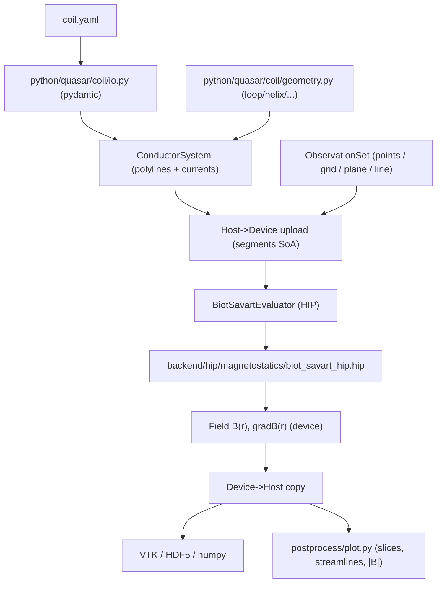

# Quasar Magnetostatics Module — Biot-Savart Field Evaluator

Add a `magnetostatics` physics module to Quasar that computes the magnetic field of arbitrary thin-wire current-carrying conductors via the Biot-Savart law on a HIP-only backend (no host/OpenMP fallback), with Python bindings, YAML-driven conductor definitions, and analytical-solution unit tests. Fits cleanly into the existing `physics × numerics × boundary × backend` layout defined in `directory_plan.md`.

## 1. Physics & math

Forward evaluation of magnetic flux density from N filament conductors at M observation points:

\[
\mathbf{B}(\mathbf{r}) = \frac{\mu_0}{4\pi} \sum_{c=1}^{N_{\text{cond}}} I_c \sum_{s \in c} \int_{\text{seg}} \frac{d\boldsymbol{\ell} \times (\mathbf{r}-\mathbf{r}')}{\lvert\mathbf{r}-\mathbf{r}'\rvert^{3}}
\]

Each curved conductor is approximated as a polyline. Per straight segment from `a` to `b` we use the numerically stable Hanson-Hirshman closed form (no quadrature needed, exact for straight segments):

```cpp
// in detail/biot_savart_segment.hpp
__device__ __forceinline__ Vec3 segment_B(Vec3 a, Vec3 b, Vec3 p, Real I) {
    const Vec3 ra = p - a;
    const Vec3 rb = p - b;
    const Real Ra = length(ra);
    const Real Rb = length(rb);
    const Vec3 L  = b - a;
    const Real denom = Ra * Rb * (Ra * Rb + dot(ra, rb));
    if (denom < kEps) return Vec3{0, 0, 0};
    const Real coeff = mu0_over_4pi * I * Real(2) * (Ra + Rb) / denom;
    return coeff * cross(ra, L);
}
```

`∇B` uses the analytic derivative of the same kernel (a second `segment_gradB` device function in the same header).

## 2. How this maps onto Quasar's four axes

- **physics**: new `magnetostatics` plug-in (the entry point) — registers via `QUASAR_REGISTER_PHYSICS("magnetostatics", ...)`.
- **numerics**: this is NOT a PDE. We add ONE small interface (`IFieldEvaluator`) under `numerics/`, separate from `ITimeIntegrator`/`ISpatialDiscretization`, so coil-design code never touches the PDE-oriented interfaces.
- **boundary**: not used — Biot-Savart on filaments has no domain boundary. Skip cleanly (no files added).
- **backend**: HIP only. The module hard-requires ROCm: when `QUASAR_ENABLE_HIP=OFF` the entire `physics/magnetostatics/` subtree is excluded from the build. This intentionally diverges from the framework's general "code compiles without ROCm" guidance — the trade-off is one less code path to maintain and identical numerical results everywhere. Reuses `backend/memory.hpp` (device allocator, mirror_view) and `backend/device.hpp` (stream handle); does NOT use `backend/parallel.hpp` (HIP kernels are launched directly).



## 3. Files to add (new module only — does not modify existing axes)

### Public headers — `include/quasar/`

- `physics/magnetostatics/conductor.hpp` — `Filament` (3D polyline + current), `ConductorSystem` (collection of filaments).
- `physics/magnetostatics/observation.hpp` — `PointCloud`, `GridBox`, `PlaneSlice`, `LineProbe` variants of `ObservationSet`.
- `physics/magnetostatics/field_evaluator.hpp` — abstract `IFieldEvaluator` with `evaluate_B(...)` and `evaluate_grad_B(...)` (returns `Field<Vec3>` / `Field<Mat3x3>`).
- `physics/magnetostatics/biot_savart.hpp` — concrete `BiotSavartEvaluator` (public so Python bindings can construct it directly).
- `physics/magnetostatics/derived.hpp` — `magnitude(B)`, `frobenius_norm(gradB)`, streamline-seeding helpers.

### Private implementations — `src/physics/magnetostatics/`

- `conductor.cpp` — polyline construction (host-side, one-time), total length, validation, segment iterator. Builds the SoA segment buffer ready for `hipMemcpy` to device.
- `geometry_generators.cpp` — `circular_loop`, `helix`, `solenoid` (multi-turn helix), `racetrack`, `polygon`, `generic_polyline`. Host-side only (called once at setup). Each registers under `Registry<IConductorGeometry>` so YAML can pick by name.
- `observation.cpp` — grid/plane/line iterators that produce a device-resident SoA point buffer.
- `biot_savart_evaluator.cpp` — orchestrator: allocates device buffers, copies conductor segments and observation points to device, launches the HIP kernels, copies results back, frees device memory. Self-registers: `QUASAR_REGISTER_FIELD_EVALUATOR("biot_savart", BiotSavartEvaluator)`. No host vs device dispatch — there is no host kernel to dispatch to.
- `detail/biot_savart_segment.hpp` — the `__device__ __forceinline__` per-segment kernel shown in §1, plus its analytic gradient `segment_gradB`. Device-only; included only from `.hip` translation units.

### Backend specialization (HIP only)

- `src/backend/hip/magnetostatics/biot_savart_hip.hip` — HIP kernel: 1 thread per observation point; shared-memory tile of `TILE` segments at a time (typical: 64–256) to amortize global loads when N is large. Inner loop calls `segment_B` from `detail/biot_savart_segment.hpp` and accumulates into a register.
- `src/backend/hip/magnetostatics/biot_savart_grad_hip.hip` — identical launch pattern for `∇B`, calling `segment_gradB`.
- `src/backend/hip/magnetostatics/launch_params.hpp` — tunables (`TILE_SEGMENTS`, block size) selected per gfx target.

### App / driver

- `apps/quasar_field/main.cpp` — parse `coil.yaml`, build `ConductorSystem`, build `ObservationSet`, call evaluator, write VTK ImageData (`B_xyz`, `|B|`, `grad_B_frob`).
- Register in `apps/CMakeLists.txt` alongside `quasar_run` and `quasar_bench`.

### Python layer

- `bindings/python/bind_magnetostatics.cpp` — pybind11 bindings for `Filament`, `ConductorSystem`, `ObservationGrid`, `BiotSavartEvaluator.evaluate_B/grad_B` (return `numpy.ndarray` views).
- `python/quasar/coil/__init__.py`
- `python/quasar/coil/geometry.py` — pure-Python conveniences: `circular_loop(...)`, `helix(...)`, `solenoid(...)`, `helmholtz_pair(...)`, `racetrack(...)`, `from_csv(...)`.
- `python/quasar/coil/io.py` — pydantic schema for the YAML deck (units, conductors, observation, output).
- `python/quasar/coil/postprocess.py` — slice plots, streamline plots, isosurface (matplotlib + optional pyvista).
- `python/quasar/coil/cli.py` — extends the top-level `quasar` console script: `quasar coil run input.yaml`.

### Input deck (proposed schema)

```yaml
units: SI
conductors:
  - name: loop_A
    current_A: 1000.0
    geometry: { type: circular_loop, radius_m: 0.1,
                center_xyz: [0, 0, -0.05], axis_xyz: [0, 0, 1],
                n_segments: 360 }
  - name: loop_B
    current_A: 1000.0
    geometry: { type: polyline, points_xyz_m: [...] }
observation:
  type: grid
  bounds_m: [[-0.2, 0.2], [-0.2, 0.2], [-0.2, 0.2]]
  resolution: [128, 128, 128]
output:
  format: vtk_imagedata
  path: ./out/B_field.vti
  fields: [B_xyz, B_magnitude, grad_B_frobenius]
# backend: hip is implicit and the only supported value
```

### Tests — all numerical verifications launch the HIP kernel and compare to closed-form analytical references

Each gtest launches the real HIP kernel (small problem sizes — typically a single warp), copies results back, and asserts against the textbook formula. The CTest harness skips these on machines without a visible ROCm device (gated by `QUASAR_HAS_HIP_RUNTIME`).

- `tests/unit/physics/magnetostatics/test_finite_segment.cpp` — single straight segment vs textbook `B = μ₀I/(4πd)·(cosθ₁−cosθ₂)`.
- `test_infinite_wire_limit.cpp` — long segment → `B = μ₀I/(2πd)`.
- `test_circular_loop_on_axis.cpp` — N-polyline loop converges to `B_z = μ₀IR²/[2(R²+z²)^{3/2}]` at O(1/N²) rate.
- `test_helmholtz_pair.cpp` — vanishing 1st & 2nd z-derivatives at midpoint.
- `test_solenoid_inside.cpp` — `B ≈ μ₀ n I` along axis inside; ≈ 0 far outside.
- `test_polyline_convergence.cpp` — log-log slope check.
- `test_fp32_vs_fp64.cpp` — fp32 vs fp64 instantiations agree to expected single-precision tolerance on a fixed seed; guards against subtle precision regressions when tuning the HIP kernel.
- `tests/python/test_coil_geometry.py` — pydantic schema round-trip, generator correctness (host-side, no HIP required).

### Examples

- `examples/single_loop/` — input deck + expected on-axis CSV + README.
- `examples/helmholtz_pair/`
- `examples/solenoid/`
- `examples/saddle_coil/` — non-trivial 3D polyline geometry.

### Docs

- `docs/theory/magnetostatics.rst` — Biot-Savart derivation, Hanson-Hirshman closed form, discretization error analysis.
- `docs/user-guide/coil_design.rst` — workflow walk-through, YAML schema reference, plotting recipes.
- `docs/dev-guide/adding_a_geometry.rst` — how to register a new conductor geometry generator (uses the existing registry recipe).

### CMake wiring (no `file(GLOB)`, per existing rules)

- `src/physics/magnetostatics/CMakeLists.txt` — sources listed explicitly; wrapped in `if(NOT QUASAR_ENABLE_HIP) return() endif()` at the top so the whole module is silently excluded on non-HIP builds. Uses `quasar_add_module(magnetostatics ...)` from `cmake/QuasarAddModule.cmake`.
- `src/backend/hip/magnetostatics/CMakeLists.txt` — sets `set_source_files_properties(*.hip PROPERTIES LANGUAGE HIP)`; same `QUASAR_ENABLE_HIP` guard.
- `bindings/python/CMakeLists.txt` — adds `bind_magnetostatics.cpp` to the `_core` pybind11 target only when `QUASAR_ENABLE_HIP=ON`; otherwise the Python `quasar.coil` module raises a clear `ImportError("quasar was built without HIP; magnetostatics requires a ROCm build")`.
- `tests/unit/physics/magnetostatics/CMakeLists.txt` — same HIP guard.
- No host backend directory exists (`src/backend/host/magnetostatics/` is intentionally absent).

## 4. Performance design

- Layout: SoA for segments (`xs[N], ys[N], zs[N], dxs[N], dys[N], dzs[N], Is[N]`) → coalesced device loads.
- HIP kernel parallelizes over observation points (M is the larger dimension for typical coil-design problems where `M ≈ 10⁶`, `N ≈ 10³–10⁵`).
- Shared-memory tile of segments: cooperative load by threads of the block, then each thread accumulates `B` against all tile segments.
- Single-precision (`float`) and double-precision (`double`) instantiations via `Real` typedef in `core/types.hpp`.
- A micro-benchmark (`benchmarks/micro/biot_savart_bench.cpp`) sweeps `(N, M)` and reports GFLOP/s.

## 5. What this plan deliberately does NOT include

- No PDE-based magnetostatics (no `∇²A = −μ₀J` solver, no mesh, no FEM/FDM).
- No magnetic materials / permeability (`μ_r ≡ 1`).
- No time-dependent magnetics (no eddy currents, no AC).
- No inductance / Lorentz-force outputs (deferrable: would slot into `derived.hpp` later).
- No design-optimization layer (scipy hook is future work).
- No `boundary/` files (Biot-Savart is unbounded vacuum).
- **No host / OpenMP backend.** The Biot-Savart kernel exists only as a HIP `__device__` function; the module hard-requires `QUASAR_ENABLE_HIP=ON` and a ROCm-visible device at runtime. This is a deliberate divergence from the framework's general "code compiles without ROCm" guidance — accepted in exchange for a single, GPU-optimized code path with no host/device numerical drift.

## 6. Phased implementation order (HIP-first)

1. **HIP vertical slice.** Public headers + `detail/biot_savart_segment.hpp` (`__device__` kernel) + `biot_savart_hip.hip` (B-field kernel only) + `BiotSavartEvaluator` (alloc/copy/launch/copy-back) + the two simplest analytical unit tests (finite segment, on-axis circular loop). End-to-end on a ROCm box from day one.
2. **Geometry + Python.** Geometry generators (host-side setup code) + YAML pydantic schema + pybind11 bindings + `python/quasar/coil/` package + `examples/single_loop/` and `examples/helmholtz_pair/`.
3. **Gradient + remaining analytical tests.** `biot_savart_grad_hip.hip` + the rest of the unit tests (infinite-wire limit, Helmholtz uniformity, solenoid, polyline convergence, fp32-vs-fp64).
4. **Performance + polish.** `launch_params.hpp` tuning per gfx target + Google Benchmark sweep + `examples/solenoid/`, `examples/saddle_coil/` + theory/user/dev docs.

## 7. Implementation todos

1. Add public headers under `include/quasar/physics/magnetostatics/` (`conductor.hpp`, `observation.hpp`, `field_evaluator.hpp`, `biot_savart.hpp`, `derived.hpp`).
2. Implement the `__device__` per-segment Biot-Savart kernel (Hanson-Hirshman closed form) and its analytic gradient in `src/physics/magnetostatics/detail/biot_savart_segment.hpp`.
3. Implement geometry generators (`circular_loop`, `helix`, `solenoid`, `racetrack`, `polygon`, `generic_polyline`) on the host (one-time setup) and register them with the conductor-geometry factory.
4. Implement HIP backend kernels (`src/backend/hip/magnetostatics/biot_savart_hip.hip`, `biot_savart_grad_hip.hip`) with shared-memory segment tiling.
5. Implement `BiotSavartEvaluator` that uploads conductor/observation data to device, launches HIP kernels, copies results back, and self-registers under `Registry<IFieldEvaluator>`.
6. Add HIP-launched unit tests against closed-form analytical references (finite segment, infinite-wire limit, on-axis circular loop, Helmholtz pair, solenoid, polyline convergence, fp32-vs-fp64).
7. Add a Google Benchmark sweep over `(N segments, M observation points)` and a basic numerical-stability check across gfx targets.
8. Add pybind11 bindings (`bind_magnetostatics.cpp`) and the `python/quasar/coil/` package (geometry helpers, pydantic YAML schema, CLI, postprocess plots).
9. Add `apps/quasar_field` driver that loads `coil.yaml`, evaluates B/|B|/grad_B on the chosen observation set, and writes VTK ImageData.
10. Add runnable examples: `single_loop`, `helmholtz_pair`, `solenoid`, `saddle_coil` (input deck + expected output + README each).
11. Add docs: `docs/theory/magnetostatics.rst`, `docs/user-guide/coil_design.rst`, `docs/dev-guide/adding_a_geometry.rst`.
12. Wire `CMakeLists.txt` for `src/physics/magnetostatics/` (requires `QUASAR_ENABLE_HIP=ON`), `src/backend/hip/magnetostatics/`, and `bindings/python/`; the magnetostatics module is excluded from the build when HIP is disabled.
