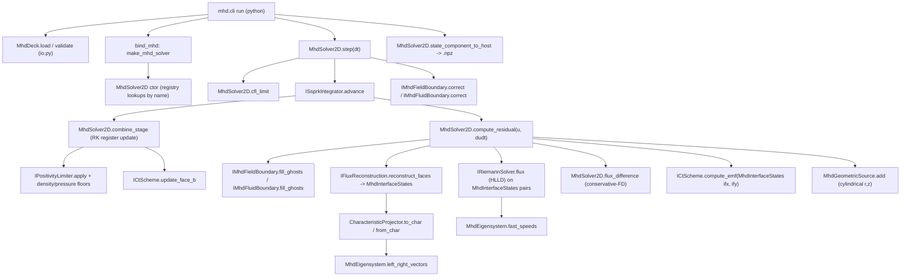

# Feature Plan: High-order ideal-MHD physics module (`physics/mhd`)

## Classification
- Axis / module: `numerics` (generalize `IFieldSolver`; new MHD interfaces) + `physics` (new `physics/mhd`) + `boundary` (MHD fluid/field BCs) ; module: **mhd**
- Touches python/quasar or bindings/python: **yes** (`python/quasar/mhd/{cli.py,io.py,__init__.py,numerics.py}`, `bindings/python/bind_mhd.cpp`)
- Adds new examples/<case>/: **yes** — five cases: `brio_wu`, `mhd_linear_wave`, `orszag_tang`, `mhd_blast`, `mhd_rotor`
- internal-only (skip docs): **no** (full dev-guide pages + changelog)
- refactor-only: **no** (feature + an explicit, gated Phase 0 refactor)
- Open questions: none — design decisions are locked (see prompt). The only consciously deferred items are noted in the design notes (annular cylindrical inner radius, MPI/multi-GPU domain decomposition) and are out of scope.

## High-level design

### Architecture

**Call graph** — caller→callee across the new public surface. `mhd.cli run` parses the deck, builds the solver via bindings, and time-steps; `MhdSolver2D::step` orchestrates an SSP-RK3 update whose stage residual is built by reconstructing the interface flux function in characteristic variables, solving the HLLD Riemann problem pointwise, differencing the fluxes (the conservative-FD step), updating the staggered B via the FD-CT EMF, applying floors/positivity, and finally enforcing fluid+field boundary conditions.



**Class diagram** — new interfaces (registry bases), their concrete schemes, the MHD state/config types, and the Phase-0-generalized field solver. `IFieldSolver` is generalized into a template `IFieldSolverT<Field, Source>` so EM-PIC (`YeeField2D`/`JField2D`) and MHD are both consumers; the existing PIC concrete types alias the EM specialization unchanged.



```mermaid
classDiagram
  class IFieldSolverT~Field,Source~ {
    <<interface>>
    +advance_b(Field&, Real dt) void
    +advance_e(Field&, const Source&, Real dt) void
  }
  IFieldSolverT~Field,Source~ <|.. YeeFdtd2D
  IFieldSolverT~Field,Source~ <|.. YeeFdtdCyl2D

  class IRiemannSolver {
    <<interface>>
    +flux(const MhdState& L, const MhdState& R, int dir, MhdFlux& out) void
    +max_wavespeed(const MhdState&, int dir, Real gamma) Real
  }
  IRiemannSolver <|.. HlldRiemann

  class IFluxReconstruction {
    <<interface>>
    +reconstruct_faces(const MhdField2D&, int dir, MhdInterfaceStates& out, Real gamma) void
    +required_nghost() int
    +is_characteristic() bool
  }
  IFluxReconstruction <|.. MusclMinmodRecon
  IFluxReconstruction <|.. Mp5Recon
  IFluxReconstruction <|.. Mp7Recon

  class ICtScheme {
    <<interface>>
    +compute_emf(const MhdField2D&, const MhdInterfaceStates& ifx, const MhdInterfaceStates& ify, EmfField2D&, Real gamma) void
    +update_face_b(MhdField2D&, const EmfField2D&, Real dt) void
    +divergence_b_linf(const MhdField2D&) Real
  }
  ICtScheme <|.. ChristliebFdCt

  class ISsprkIntegrator {
    <<interface>>
    +advance(MhdSolver2D&, Real dt) void
    +n_stages() int
  }
  ISsprkIntegrator <|.. Ssprk3

  class MhdInterfaceStates {
    +Grid2D grid
    +int dir
    +DeviceBuffer Lrho,Lmx,Lmy,Lmz,Lenergy,Lbx,Lby,Lbz
    +DeviceBuffer Rrho,Rmx,Rmy,Rmz,Renergy,Rbx,Rby,Rbz
    +state_left(i,j) MhdState
    +state_right(i,j) MhdState
  }

  class IPositivityLimiter {
    <<interface>>
    +apply(MhdField2D&, Real rho_floor, Real p_floor, Real gamma) void
  }
  IPositivityLimiter <|.. TroubledCellLimiter

  class IMhdFluidBoundary {
    <<interface>>
    +fill_ghosts(MhdField2D&, Side) void
    +correct(MhdField2D&, Side) void
  }
  IMhdFluidBoundary <|.. MhdPeriodicFluid
  IMhdFluidBoundary <|.. MhdOutflowFluid
  IMhdFluidBoundary <|.. MhdReflectingFluid

  class IMhdFieldBoundary {
    <<interface>>
    +fill_ghosts(MhdField2D&, Side) void
  }
  IMhdFieldBoundary <|.. MhdPeriodicField
  IMhdFieldBoundary <|.. MhdOutflowField
  IMhdFieldBoundary <|.. MhdReflectingField

  class CharacteristicProjector {
    +to_char(const MhdState&, const MhdEigensystem&) array
    +from_char(const array&, const MhdEigensystem&) MhdState
  }
  class MhdEigensystem {
    +build(const MhdState&, int dir, Real gamma) void
    +left_right_vectors(...) void
    +fast_speeds(...) void
  }
  CharacteristicProjector ..> MhdEigensystem

  class MhdField2D {
    +Grid2D grid
    +DeviceBuffer rho, mx, my, mz, energy
    +DeviceBuffer bx_face, by_face, bz_cell
  }
  class MhdConfig {
    +Grid2D grid
    +Real gamma
    +string geometry
    +string reconstruction
    +string riemann
    +string integrator
    +string ct
    +Real rho_floor, p_floor
    +MhdBoundarySpec boundary
  }
  class MhdSolver2D {
    +step(Real dt) void
    +cfl_limit() Real
    +divergence_b_max() Real
    +compute_residual(const MhdField2D& u, MhdField2D& dudt) void
    +combine_stage(int stage, Real dt) void
    +rk_register(int k) MhdField2D&
    +n_rk_registers() int
  }
  MhdSolver2D *-- MhdConfig
  MhdSolver2D *-- MhdField2D
  MhdSolver2D *-- MhdInterfaceStates
  MhdSolver2D ..> IFluxReconstruction
  MhdSolver2D ..> IRiemannSolver
  MhdSolver2D ..> ICtScheme
  MhdSolver2D ..> ISsprkIntegrator
  MhdSolver2D ..> IPositivityLimiter
  MhdSolver2D ..> IMhdFluidBoundary
  MhdSolver2D ..> IMhdFieldBoundary
  MhdSolver2D ..> MhdGeometricSource
  IFluxReconstruction ..> MhdInterfaceStates
  ICtScheme ..> MhdInterfaceStates
```

- **Components / modules touched (new vs modified):**
  - *Modified (Phase 0, behavior-preserving):* `include/quasar/numerics/field_solver.hpp` (template generalization + EM aliases); a new `src/numerics/field_solver.cpp` holding the generalized base's out-of-line bits while `YeeFdtd2D`/`YeeFdtdCyl2D` definitions stay where they are; `src/numerics/CMakeLists.txt` (**already exists** — add `field_solver.cpp` to its `_quasar_numerics_sources` list; it already uses `quasar_add_module(numerics REGISTERS ...)` and links `quasar_pic_hip`); `include/quasar/physics/pic/pic_solver.hpp` and `src/physics/pic/pic_solver.cpp` adjust to the aliased interface name only.
  - *New (numerics axis):* `include/quasar/numerics/mhd_state.hpp` (`MhdState`, `MhdFlux`, conserved<->primitive), `mhd_eigensystem.hpp`, `characteristic_projection.hpp`, `interface_states.hpp` (`MhdInterfaceStates`), `riemann_solver.hpp`, `flux_reconstruction.hpp`, `ct_scheme.hpp`, `ssprk_integrator.hpp`, `positivity_limiter.hpp`. The new `numerics` C++ TUs (`mhd_state.cpp`, `hlld_riemann.cpp`, `flux_reconstruction.cpp`, `ct_scheme.cpp`, `ssprk_integrator.cpp`, `positivity_limiter.cpp`) compile **into the existing `quasar_numerics` module** by being added to `src/numerics/CMakeLists.txt` — see the single-owner resolution under Axis placement.
  - *New (physics axis):* `include/quasar/physics/mhd/{mhd_field.hpp,mhd_solver.hpp,mhd_geometric_source.hpp,kernels.hpp}`; `src/physics/mhd/{mhd_solver.cpp,mhd_geometric_source.cpp,mhd_boundary.cpp}` plus a new `src/physics/mhd/CMakeLists.txt`; parent `src/physics/CMakeLists.txt` gains `add_subdirectory(mhd)`. (No `mhd_schemes.cpp` — registrations live next to their classes in `src/numerics/*.cpp` and `src/physics/mhd/mhd_boundary.cpp`, kept alive by the modules' `REGISTERS` flag.)
  - *New (boundary axis):* `include/quasar/boundary/mhd_boundary.hpp`; concrete MHD BCs implemented + registered in `src/physics/mhd/mhd_boundary.cpp` (the `quasar_mhd` module declares `REGISTERS`, so WHOLE_ARCHIVE keeps the initializers — no force-reference trick).
  - *New (backend):* `src/backend/hip/mhd/*.hip` kernels (reconstruction, HLLD, flux-difference, CT-EMF, SSP-RK3 combine, floors, geometric source) with launch wrappers declared in `include/quasar/physics/mhd/kernels.hpp`; a new `src/backend/hip/mhd/CMakeLists.txt`; parent `src/backend/hip/CMakeLists.txt` gains `add_subdirectory(mhd)`.
  - *New (Python/bindings):* `bindings/python/bind_mhd.cpp`; `python/quasar/mhd/{__init__.py,io.py,cli.py,numerics.py}`.
  - *New (examples + tests + docs):* five `examples/<case>/{input.yaml,README.md}`; `tests/python/test_examples.py` entries; `tests/unit/physics/mhd/` (+ its `CMakeLists.txt`); new entries in `tests/unit/numerics/CMakeLists.txt`; `docs/dev-guide/adding_a_{riemann_solver,reconstruction_scheme,integrator,ct_scheme}.rst`.

- **Axis placement & ownership boundaries:** the generalized solver interface and all MHD numerical-scheme headers live under `include/quasar/numerics/`; their out-of-line definitions compile into the **existing `quasar_numerics` static module** (`src/numerics/`). State/field/solver/geometric-source/boundary implementations live under `physics/mhd` and compile into a new `quasar_mhd` module. All device code is confined to `src/backend/hip/mhd/`; everything else reaches the GPU only through `include/quasar/backend/{device,memory}.hpp`. No `if/else` over scheme names in the driver — selection is by registry string from the deck.
  - **Single-owner CMake resolution (fixes the prior double-owner / orphaned-source bug):** to avoid two Phase-3 tasks editing `src/numerics/CMakeLists.txt`, **all new `src/numerics/*.cpp`** (the Phase-0 `field_solver.cpp` AND every MHD numerics TU `mhd_state.cpp`/`hlld_riemann.cpp`/`flux_reconstruction.cpp`/`ct_scheme.cpp`/`ssprk_integrator.cpp`/`positivity_limiter.cpp`) are added to `src/numerics/CMakeLists.txt` by the **single** Phase-0 task (Task 3.0), which is the **only** Phase-3 task that edits that file. Each MHD numerics implementer therefore writes only its `.cpp`/`.hpp` (never the CMakeLists). This keeps every `src/numerics/*.cpp` compiled and the file single-owner.

- **Dev-guide pages (pluggable schemes):** new `docs/dev-guide/adding_a_riemann_solver.rst`, `adding_a_reconstruction_scheme.rst`, `adding_a_integrator.rst`, `adding_a_ct_scheme.rst`, each mirroring `docs/dev-guide/adding_a_field_solver.rst` and citing the `quasar_add_module(... REGISTERS ...)` WHOLE_ARCHIVE convention (the same one the field-solver guide and the existing numerics/boundary/magnetostatics modules use). Fluid/field MHD BCs follow `docs/dev-guide/adding_a_boundary.rst` (updated to mention the MHD bases).

- **Registry registration point + survival convention:** `include/quasar/core/registry.hpp` gains new axis sugar macros `QUASAR_REGISTER_RIEMANN_SOLVER`, `QUASAR_REGISTER_FLUX_RECONSTRUCTION`, `QUASAR_REGISTER_INTEGRATOR`, `QUASAR_REGISTER_CT_SCHEME`, `QUASAR_REGISTER_POSITIVITY_LIMITER`, `QUASAR_REGISTER_MHD_FLUID_BOUNDARY`, `QUASAR_REGISTER_MHD_FIELD_BOUNDARY` (each expands to `QUASAR_REGISTRY_REGISTER`). **Registration survival uses the standard `REGISTERS` → WHOLE_ARCHIVE mechanism from `cmake/QuasarAddModule.cmake`** (verified: `src/numerics`, `src/boundary`, `src/physics/magnetostatics`, `src/physics/analytic_fields` all pass `REGISTERS`). Concretely: the MHD numerics schemes (HLLD/MP*/SSP-RK3/CT/positivity) self-register at the bottom of their own `.cpp` in `src/numerics/` (the `quasar_numerics` module already has `REGISTERS`); the MHD fluid/field BCs self-register in `src/physics/mhd/mhd_boundary.cpp` and the `quasar_mhd` module is declared `quasar_add_module(mhd REGISTERS ...)`. **No externally-referenced-TU force-reference is needed** — `mhd_schemes.cpp` is dropped from the plan; registrations live next to the class definitions they register.

### Key interfaces (the blind contract)

**Conserved state (cell-centered) + flux** — `include/quasar/numerics/mhd_state.hpp`
```cpp
namespace quasar::numerics {
struct MhdState {            // conserved: rho, momentum, total energy, B (cell, for reconstruction)
  Real rho, mx, my, mz, energy, bx, by, bz;
};
struct MhdPrim { Real rho, vx, vy, vz, p, bx, by, bz; };
struct MhdFlux { Real rho, mx, my, mz, energy, bx, by, bz; };
MhdPrim  to_primitive(const MhdState&, Real gamma);      // p=(gamma-1)*rho*e
MhdState to_conserved(const MhdPrim&,  Real gamma);
Real     pressure(const MhdState&, Real gamma);
Real     fast_magnetosonic_speed(const MhdState&, int dir, Real gamma); // dir: 0=x,1=y
}
```

**Generalized field solver (Phase 0)** — `include/quasar/numerics/field_solver.hpp`
```cpp
namespace quasar::numerics {
template <class Field, class Source>
class IFieldSolverT {
 public:
  virtual ~IFieldSolverT() = default;
  virtual void advance_b(Field& f, Real dt) const = 0;
  virtual void advance_e(Field& f, const Source& src, Real dt) const = 0;
};
// Behavior-preserving EM aliases — existing registrations/clients unchanged:
using IFieldSolver = IFieldSolverT<YeeField2D<Real>, JField2D<Real>>;
}  // YeeFdtd2D<Order>/YeeFdtdCyl2D still derive from IFieldSolver; "yee_o2"/"yee_o4"/"yee_cyl_o2" unchanged.
```

**Interface-state container** — `include/quasar/numerics/interface_states.hpp` (the single, unified L/R reconstructed-state type used by reconstruction → HLLD → CT; resolves the prior type-ambiguity by being distinct from the cell-centered `MhdField2D` storage type)
```cpp
namespace quasar::numerics {
// Reconstructed CONSERVED states on the interfaces normal to `dir` (dir: 0=x,1=y).
// For dir=0 there is one interface between cells (i-1,j) and (i,j) at index (i,j):
// L is the state extrapolated from the left cell, R from the right cell. The 8
// components are the SAME conserved layout as MhdState in the SAME order
// (rho, mx, my, mz, energy, bx, by, bz). bx/by/bz here are the cell-reconstructed
// B used to form fluxes and the EMF — they are NOT the CT face-staggered storage
// (that lives only in MhdField2D::bx_face/by_face). One MhdInterfaceStates is
// produced per direction (ifx for dir=0, ify for dir=1).
template <class T> struct MhdInterfaceStates {
  Grid2D grid{};
  int dir{0};
  backend::DeviceBuffer<T> Lrho,Lmx,Lmy,Lmz,Lenergy,Lbx,Lby,Lbz;  // left  of each normal face
  backend::DeviceBuffer<T> Rrho,Rmx,Rmy,Rmz,Renergy,Rbx,Rby,Rbz;  // right of each normal face
  MhdInterfaceStates(Grid2D g, int direction);
  std::size_t component_size() const noexcept { return grid.storage_size(); }
  // host/device helpers (host overloads in tests) returning the 8-component
  // MhdState at face (i,j); device kernels read the raw component pointers.
  MhdState state_left (int i, int j) const;
  MhdState state_right(int i, int j) const;
};
}
```

**MHD scheme interfaces** — `include/quasar/numerics/{riemann_solver,flux_reconstruction,ct_scheme,ssprk_integrator,positivity_limiter}.hpp`
```cpp
class IRiemannSolver {                       // registry: "hlld"
 public: virtual ~IRiemannSolver()=default;
  // Pointwise flux from a single L/R conserved-state pair (the pairs come from
  // MhdInterfaceStates::state_left/right at each interface). dir: 0=x,1=y.
  virtual void flux(const MhdState& L, const MhdState& R, int dir, MhdFlux& out) const = 0;
  virtual Real max_wavespeed(const MhdState&, int dir, Real gamma) const = 0;
};
class IFluxReconstruction {                  // registry: "muscl_minmod","mp5","mp7"
 public: virtual ~IFluxReconstruction()=default;
  virtual int  required_nghost() const = 0;  // muscl=2, mp5=3, mp7=4
  virtual bool is_characteristic() const = 0;
  // Reconstruct the auxiliary interface flux function h (Shu-Osher conservative-FD
  // sense) in characteristic variables, writing the L/R conserved states for every
  // interface normal to `dir` into `out` (out.dir must equal dir).
  virtual void reconstruct_faces(const MhdField2D<Real>& u, int dir,
                                 MhdInterfaceStates<Real>& out,
                                 Real gamma) const = 0;
};
class ICtScheme {                            // registry: "fd_ct_christlieb"
 public: virtual ~ICtScheme()=default;
  // Build the edge-centered EMF from the SAME reconstructed interface states the
  // flux uses (ifx: dir=0 faces, ify: dir=1 faces), so div B cancels by construction.
  virtual void compute_emf(const MhdField2D<Real>& u,
                           const MhdInterfaceStates<Real>& ifx,
                           const MhdInterfaceStates<Real>& ify,
                           EmfField2D<Real>& emf, Real gamma) const = 0;
  virtual void update_face_b(MhdField2D<Real>&, const EmfField2D<Real>&, Real dt) const = 0;
  virtual Real divergence_b_linf(const MhdField2D<Real>&) const = 0;
};
// SSP-RK3 owns the time loop for ONE step; it does not own state. It calls back
// into the solver: compute_residual(u, dudt) to evaluate L(u) into a scratch
// register, then combine_stage(stage, dt) to form the next stage register
// (U^(1), U^(2), U^(n+1)) from the solver-owned RK registers + apply
// floors/positivity + CT face-B update. The solver allocates and owns all
// stage scratch (see MhdSolver2D::rk_register / combine_stage below).
class ISsprkIntegrator {                      // registry: "ssprk3"
 public: virtual ~ISsprkIntegrator()=default;
  virtual int  n_stages() const = 0;         // 3 for ssprk3
  virtual void advance(class MhdSolver2D& solver, Real dt) const = 0;
};
class IPositivityLimiter {                     // registry: "troubled_cell"
 public: virtual ~IPositivityLimiter()=default;
  virtual void apply(MhdField2D<Real>&, Real rho_floor, Real p_floor, Real gamma) const = 0;
};
```

**State field + EMF field** — `include/quasar/physics/mhd/mhd_field.hpp`
```cpp
namespace quasar::mhd {
template <class T> struct MhdField2D {        // cell-centered conserved + CT face-staggered B
  Grid2D grid{};
  backend::DeviceBuffer<T> rho, mx, my, mz, energy;   // cell-centered
  backend::DeviceBuffer<T> bx_face, by_face;          // face-staggered (CT primary)
  backend::DeviceBuffer<T> bz_cell;                    // out-of-plane (cell-centered, toroidal)
  explicit MhdField2D(Grid2D g);
  std::size_t component_size() const noexcept { return grid.storage_size(); }
};
template <class T> struct EmfField2D { Grid2D grid{}; backend::DeviceBuffer<T> ez_edge, ex_edge, ey_edge; };
}
```

**Config + solver** — `include/quasar/physics/mhd/mhd_solver.hpp`
```cpp
namespace quasar::mhd {
struct MhdConfig {
  Grid2D grid{};
  Real gamma{Real{5}/Real{3}};
  std::string geometry{"cartesian"};          // "cartesian" | "cylindrical"
  std::string reconstruction{"mp7"};          // registry name
  std::string riemann{"hlld"};
  std::string integrator{"ssprk3"};
  std::string ct{"fd_ct_christlieb"};
  std::string positivity{"troubled_cell"};
  Real rho_floor{Real{1e-8}}, p_floor{Real{1e-9}};
  boundary::MhdBoundarySpec boundary{};
};
class MhdSolver2D {
 public:
  // The ctor is the AUTHORITY on ghost width: it sets the working grid's nghost to
  // max(cfg.grid.nghost, reconstruction->required_nghost()) and THROWS
  // std::invalid_argument if cfg.grid.nghost is positive but smaller than the
  // reconstruction's required_nghost() (an under-sized deck is a hard error, not a
  // silent re-pad). This mirrors the PIC ctor's fdtd_order>=2-ghost check.
  explicit MhdSolver2D(MhdConfig cfg);
  Grid2D grid() const noexcept;
  MhdField2D<Real>& state() noexcept;
  void seed_state(std::string_view component, const std::vector<Real>& host_buf); // "rho","mx",...,"bx_face","by_face","bz_cell"
  void step(Real dt);
  void advance(Real t_end, Real dt);
  Real cfl_limit() const;                      // dt <= cfl * min(dx,dy)/(|v|+c_fast)_max
  Real divergence_b_max() const;               // L-inf of discrete div B
  std::vector<Real> state_component_to_host(std::string_view component) const;
  const MhdConfig& config() const noexcept;

  // ---- Integrator callback contract (the ISsprkIntegrator <-> solver seam) ----
  // The solver OWNS all SSP-RK3 scratch: the live state (rk_register(0)) plus
  // n_rk_registers()-1 stage registers and one residual register. The integrator
  // calls ONLY these on the solver, never touches device buffers directly:
  void compute_residual(const MhdField2D<Real>& u, MhdField2D<Real>& dudt);
  // Forms the SSP-RK3 stage update for `stage` in [0, n_stages): reads the
  // appropriate rk_register(s) + the residual register, writes the next stage
  // register, applies the positivity limiter + floors, and runs the CT face-B
  // update so face B and cell-centered state stay consistent within the stage.
  void combine_stage(int stage, Real dt);
  MhdField2D<Real>& rk_register(int k);        // k in [0, n_rk_registers())
  MhdField2D<Real>& residual_register();
  int n_rk_registers() const noexcept;         // 2 stage registers + live state for ssprk3
};
}
```
> **Integrator data-flow (pins ownership across Tasks 3.5/3.7/3.9):** `MhdSolver2D` (Task 3.7) allocates the live state, the stage registers, the residual register, and the per-direction `MhdInterfaceStates` (`ifx`,`ify`); it exposes them via `rk_register`/`residual_register`. `Ssprk3::advance` (Task 3.5) is a thin host loop: for each of the 3 SSP-RK3 stages it calls `solver.compute_residual(u_stage, dudt)` then `solver.combine_stage(stage, dt)`. `compute_residual` and `combine_stage` (Task 3.7) are the ONLY callers of the HIP launch wrappers (Task 3.9): `compute_residual` invokes `launch_mhd_reconstruct` → `launch_mhd_hlld_flux` → `launch_mhd_flux_difference` → `launch_mhd_ct_emf` → `launch_mhd_geometric_source`; `combine_stage` invokes `launch_mhd_rk_stage` (the register combine), `launch_mhd_apply_floors` (via the positivity limiter), and `launch_mhd_face_b_update`. The integrator never calls a launch wrapper itself, and the kernels never allocate the registers.

**Boundary** — `include/quasar/boundary/mhd_boundary.hpp`
```cpp
namespace quasar::boundary {
struct MhdBoundarySpec {            // order: x_lo, x_hi, y_lo, y_hi
  std::array<std::string,4> fluid{"periodic","periodic","periodic","periodic"};  // "periodic"|"outflow"|"reflecting"
  std::array<std::string,4> field{"periodic","periodic","periodic","periodic"};  // "periodic"|"outflow"|"reflecting"
};
class IMhdFluidBoundary { public: virtual ~IMhdFluidBoundary()=default;
  virtual void fill_ghosts(mhd::MhdField2D<Real>&, Side) const = 0;
  virtual void correct(mhd::MhdField2D<Real>&, Side) const {} };
class IMhdFieldBoundary { public: virtual ~IMhdFieldBoundary()=default;
  virtual void fill_ghosts(mhd::MhdField2D<Real>&, Side) const = 0; };
}
```

**CLI / deck / bindings (the parity contract):**
- CLI: `python -m quasar.mhd.cli run <input.yaml>` -> writes `out.npz` (mirrors `quasar.pic.cli`), with `--steps-override`, `--write-every`, `--log-every`, `--print-config`, `--verbose`.
- `out.npz` keys: `final_step`, `final_time_s`, `nx`, `ny`, `nghost`, `geometry`, `gamma`, and `state_{rho,mx,my,mz,energy,bx,by,bz}` (face B sampled to cell centers for output), plus `divb_linf` (per-snapshot div B diagnostic), and `snapshot_*` series under cadence.
- `MhdDeck` YAML schema (`python/quasar/mhd/io.py`) — top-level keys:
  ```yaml
  units: normalized
  domain: {nx, ny, lx_m, ly_m, origin_x_m?, origin_y_m?}
  geometry: cartesian | cylindrical
  numerics: {gamma, reconstruction: mp7, riemann: hlld, integrator: ssprk3,
             ct: fd_ct_christlieb, positivity: troubled_cell,
             rho_floor, p_floor, cfl}
  initial: {type: <token>, params: {...}}    # token from the canonical list below
  time: {dt_s: auto|<float>, steps, t_end?}
  diagnostics: {output_path, cadence, fields: [rho,...], divb: true}
  boundary: {fluid: [...], field: [...]}     # scalar | 4-list | side-keyed map (reuse PIC _parse_side_map)
  ```
  **Canonical `initial.type` token list (the SINGLE source of truth — Task 3.11 deck validation and Task 3.12 decks must both use exactly these, and they decouple the example DIRECTORY name from the initial-condition token):**
  `brio_wu`, `alfven_wave`, `orszag_tang`, `blast`, `rotor`. The five example directories map to tokens as: `brio_wu` → `brio_wu`; `mhd_linear_wave` → `alfven_wave`; `orszag_tang` → `orszag_tang`; `mhd_blast` → `blast`; `mhd_rotor` → `rotor`. `MhdDeck` validation rejects any `initial.type` not in this list.
  Registry-name fields (`reconstruction`/`riemann`/`integrator`/`ct`/`positivity`/`boundary.*`) are validated against the live C++ registries exposed through bindings (mirroring `_core.pic.registered_*`), so a newly-registered scheme needs no Python edit.
- Bindings: `bind_mhd.cpp` exposes `Grid2D` (reuse), `MhdConfig`, `MhdSolver2D` (with `step`, `seed_state`, `state_component_to_host`, `divergence_b_max`, `cfl_limit`), and `registered_riemann_solvers()/registered_reconstructions()/registered_integrators()/registered_ct_schemes()/registered_positivity_limiters()/registered_mhd_fluid_boundaries()/registered_mhd_field_boundaries()`, reachable as `_core.mhd.*`.

- **Integration points (header : symbol):**
  - `quasar/core/registry.hpp : QUASAR_REGISTRY_REGISTER` (new sugar macros) + `cmake/QuasarAddModule.cmake : quasar_add_module(... REGISTERS ...)` for survival
  - `quasar/core/grid.hpp : Grid2D` (reused; the `MhdSolver2D` ctor is authoritative — it raises `nghost` to `reconstruction->required_nghost()` and errors if the deck under-sized a positive nghost)
  - `quasar/backend/memory.hpp : DeviceBuffer / mirror_view`
  - `quasar/numerics/field_solver.hpp : IFieldSolverT / IFieldSolver` (Phase 0)
  - `quasar/numerics/interface_states.hpp : MhdInterfaceStates` (reconstruction↔HLLD↔CT seam)
  - `quasar/boundary/boundary_condition.hpp : Side` (reused enum)

## Behavioral acceptance criteria (observable, NO test names)

- The entire existing EM-PIC and magnetostatics test suite continues to pass after the Phase 0 field-solver interface generalization (no observable change to PIC results, registry names, or CLI output).
- `python -m quasar.mhd.cli run` consumes a YAML deck and writes an `out.npz` containing the conserved MHD state and a recorded div B diagnostic; an invalid deck (unknown scheme name, negative gamma, non-positive grid, CFL-violating explicit dt) is rejected with a clear error before any stepping.
- The discrete div B remains at machine epsilon (does not grow beyond a small multiple of round-off) throughout a full Orszag–Tang vortex run, for both the low-order baseline and the high-order scheme.
- Total mass, total momentum, and total energy are conserved to round-off over a periodic Orszag–Tang run (no boundary flux), and the run reproduces the canonical vortex/current-sheet structure (density extrema and central pressure within accepted tolerance of the reference at the standard output time).
- A smooth circularly-polarized Alfvén / linear MHD wave advected through a periodic box exhibits a measured L1 convergence rate under grid refinement that approaches 7 for the headline scheme and approaches the baseline scheme's nominal order for the fallback scheme.
- A Brio–Wu shock tube reproduces the standard 1D reference solution — including the compound (intermediate) wave structure and the contact/shock locations — within tolerance at the reference time, with no spurious oscillations exceeding the limiter's monotonicity bound.
- Density and pressure stay strictly positive throughout an MHD strong-blast and an MHD rotor run; where the high-order reconstruction would produce a negative state, the scheme demonstrably falls back to a positivity-preserving low-order update rather than crashing or producing NaNs.
- An MHD rotor produces the expected rotating-disk torsional Alfvén-wave pattern and the blast produces a near-circular fast-magnetosonic shell; both remain free of div-B-sourced artifacts.
- In axisymmetric cylindrical (r,z) mode with full poloidal+toroidal field, a configuration whose geometric source terms balance the radial pressure/tension gradient stays stationary to truncation order (a steady state does not drift), and div B in the cylindrical discretization stays at machine epsilon.
- A user-supplied timestep above the MHD CFL limit (max fast-magnetosonic signal speed) is rejected; the `auto` timestep produces a stable run.
- The chosen scheme is selected purely by deck string name through the registry (changing `reconstruction: mp7` to `muscl_minmod` requires no recompile and changes only accuracy/robustness, not the run's validity).

## Phase 2: RED tests (parallel writers)

> Phase 0's regression gate is the **existing** PIC/magnetostatics suite (no new RED tests for the refactor — its contract is "nothing changes"). Phase 2 writes NEW failing tests for MHD behavior only.

### Task 2.1: MHD core numerics unit tests (C++) — owns the numerics test CMakeLists
- Files written: [`tests/unit/numerics/test_mhd_state.cpp`, `tests/unit/numerics/test_mhd_eigensystem.cpp`, `tests/unit/numerics/test_hlld_riemann.cpp`, `tests/unit/numerics/CMakeLists.txt`]
- CMake: `tests/unit/numerics/CMakeLists.txt` has an explicit `foreach(_test_name IN ITEMS ...)` list. Task 2.1 is the **single** Phase-2 owner of this file; it appends ALL new numerics MHD test names from BOTH Task 2.1 and Task 2.2 to that ITEMS list (`test_mhd_state test_mhd_eigensystem test_hlld_riemann test_flux_reconstruction test_ct_divergence test_ssprk3_integrator test_positivity_limiter`). Each new target links `quasar::core` + `GTest::gtest_main` and is HIP-tagged if it touches device buffers (copy the existing per-target pattern, incl. the `set_source_files_properties(... LANGUAGE HIP)` form used for `test_filter_impulse_response`).
- Behavior pinned: conserved<->primitive round-trip and gamma-law pressure; left/right eigenvectors satisfy L*R = I and diagonalize the flux Jacobian, with regularized degeneracies (B->0, coincident speeds) staying finite; HLLD returns the exact flux for trivial/uniform states, satisfies consistency (returns the physical flux for L==R) and conservation, and recovers the correct fast/Alfvén/slow/contact wave fan for a Brio–Wu interface.
- Interface targeted: `MhdState`/`MhdPrim`/`to_primitive`/`to_conserved`/`pressure`/`fast_magnetosonic_speed`; `IRiemannSolver` "hlld"; `MhdEigensystem`.

### Task 2.2: Reconstruction + CT + integrator unit tests (C++)
- Files written: [`tests/unit/numerics/test_flux_reconstruction.cpp`, `tests/unit/numerics/test_ct_divergence.cpp`, `tests/unit/numerics/test_ssprk3_integrator.cpp`, `tests/unit/numerics/test_positivity_limiter.cpp`]
- CMake: Task 2.2 writes ONLY its `.cpp` files. Its test names are registered in `tests/unit/numerics/CMakeLists.txt` by **Task 2.1** (the single owner of that file) — see Task 2.1's CMake note. This keeps the shared CMakeLists single-owner within Phase 2.
- Behavior pinned: MP5/MP7 reconstruct a smooth flux function at design order and clip a discontinuity monotonically; `required_nghost` reports 2/3/4 for muscl/mp5/mp7; the FD-CT update keeps discrete div B at machine epsilon on a divergence-free seed after a step; SSP-RK3 advances dy/dt=lambda*y with the strong-stability property and reduces a smooth ODE error at 3rd order; the positivity limiter restores a state with a forced-negative pressure to a positive floored state and leaves a positive state untouched.
- Interface targeted: `IFluxReconstruction` ("muscl_minmod"/"mp5"/"mp7"), `ICtScheme` ("fd_ct_christlieb"), `ISsprkIntegrator` ("ssprk3"), `IPositivityLimiter` ("troubled_cell").

### Task 2.3: Solver-level + cylindrical + registry-survival tests (C++) — owns the new mhd test dir + its parent wiring
- Files written: [`tests/unit/physics/mhd/test_mhd_solver_conservation.cpp`, `tests/unit/physics/mhd/test_mhd_divergence_free.cpp`, `tests/unit/physics/mhd/test_mhd_cylindrical_source.cpp`, `tests/unit/physics/mhd/test_mhd_scheme_registry_linkage.cpp`, `tests/unit/physics/mhd/CMakeLists.txt`, `tests/unit/physics/CMakeLists.txt`]
- CMake: create `tests/unit/physics/mhd/CMakeLists.txt` (copy the `tests/unit/physics/pic/CMakeLists.txt` pattern: a `set(_quasar_mhd_tests ...)` list + `foreach(... IN LISTS ...)` that builds `quasar_<name>`, HIP-tags the `.cpp`, links `quasar::core` + `GTest::gtest_main`, and `add_test(NAME "mhd_<name>" ...)`), and add `add_subdirectory(mhd)` to `tests/unit/physics/CMakeLists.txt` (currently lists analytic_fields/magnetostatics/pic). Task 2.3 is the single Phase-2 owner of both these CMake files.
- Behavior pinned: a periodic smooth run conserves mass/momentum/energy to round-off and keeps div B at machine epsilon; the CFL limit rejects an over-large dt; the cylindrical (r,z) geometric-source path holds a balanced steady state stationary and keeps cylindrical div B at epsilon; every MHD registry ("hlld","mp7","mp5","muscl_minmod","ssprk3","fd_ct_christlieb","troubled_cell", MHD fluid/field BC names) is populated (the `REGISTERS`/WHOLE_ARCHIVE link keeps the initializers — same survival mechanism as the PIC/boundary registry-linkage tests).
- Interface targeted: `MhdSolver2D`, `MhdConfig`, the registries, cylindrical geometry path.

### Task 2.4: Python deck / CLI / bindings tests
- Files written: [`tests/python/test_mhd_io.py`, `tests/python/test_mhd_cli.py`, `tests/python/test_mhd_bindings.py`]
- Behavior pinned: `MhdDeck` parses/validates the schema and rejects bad gamma/grid/scheme-name/CFL-violating dt; the CLI `run` produces an `out.npz` with the documented keys and a finite, small div B series; bindings expose `MhdSolver2D` with NumPy state readback and the `registered_*` introspection lists.
- Interface targeted: `quasar.mhd.io.MhdDeck`, `quasar.mhd.cli.main`, `_core.mhd.*`.

### Task 2.5: Example integration entries
- Files written: [`tests/python/test_examples.py`] (append five MHD cases; this file is owned solely by Task 2.5 within Phase 2)
- Behavior pinned: each of the five example decks runs end-to-end via the CLI and its `out.npz` matches its closed-form / canonical reference — Brio–Wu vs the standard 1D reference; linear MHD wave yielding a ~7th-order L1 convergence rate across two refinements; Orszag–Tang structural + conserved-quantity checks; blast + rotor strong-shock structural and positivity checks.
- Interface targeted: the CLI + the five `examples/<case>/input.yaml` decks (decks/READMEs are produced in Phase 3 Task 3.12).

## Phase 3: GREEN source (parallel BLIND implementers)

> All Phase-3 `Files written:` lists are disjoint. No `tests/` paths anywhere. Each implementer verifies only via `cmake --build`. Phase 0 (3.0) is a hard prerequisite gate: it must build green AND the existing PIC/magnetostatics ctest suite must pass before Tasks 3.1–3.12 are dispatched.

### Task 3.0: Phase 0 — generalize `IFieldSolver` + own ALL `src/numerics/CMakeLists.txt` edits
- Files written: [`include/quasar/numerics/field_solver.hpp`, `src/numerics/field_solver.cpp`, `src/numerics/CMakeLists.txt`, `include/quasar/physics/pic/pic_solver.hpp`, `src/physics/pic/pic_solver.cpp`, `include/quasar/core/registry.hpp`]
- In-scope: introduce `IFieldSolverT<Field,Source>` and the `using IFieldSolver = IFieldSolverT<YeeField2D<Real>,JField2D<Real>>` alias; keep `YeeFdtd2D<Order>`/`YeeFdtdCyl2D` deriving from the alias; preserve registry names "yee_o2"/"yee_o4"/"yee_cyl_o2". **`src/numerics/CMakeLists.txt` ALREADY EXISTS** (it has `_quasar_numerics_sources = filter.cpp` and `quasar_add_module(numerics REGISTERS SOURCES ...)`): edit its source list to add `field_solver.cpp` AND all six MHD numerics TUs that Tasks 3.1–3.5 write into `src/numerics/` (`mhd_state.cpp`, `hlld_riemann.cpp`, `flux_reconstruction.cpp`, `ct_scheme.cpp`, `ssprk_integrator.cpp`, `positivity_limiter.cpp`), HIP-tagging each (they include backend memory headers) — this is the **single-owner** resolution so no other Phase-3 task touches this file. Also add the new MHD registry sugar macros to `include/quasar/core/registry.hpp` here (Task 3.0 is the ONLY Phase-3 task that edits `registry.hpp`). Out-of-scope: any MHD class body (Tasks 3.1–3.5 write those `.cpp`/`.hpp`); any kernel; any change to PIC numerical results.
- Behavioral acceptance for this slice: the EM-PIC and magnetostatics suites behave identically; the `QUASAR_REGISTER_FIELD_SOLVER` macro and existing registrations compile and link unchanged.
- Interface signatures: as in "Generalized field solver (Phase 0)" above; registry macros as listed under "Registry registration point + survival convention".
- **Gate:** `ctest --preset hip-gfx942-release -R "pic|magneto"` green before Phase 3 fan-out (Tasks 3.1–3.12 dispatch only after 3.0 builds + this gate passes; the new MHD names referenced by the CMakeLists are created by 3.1–3.5 in the same fan-out, so the numerics module compiles once all return).

### Task 3.1: MHD state, primitives, flux, eigensystem, characteristic projection, interface-state type
- Files written: [`include/quasar/numerics/mhd_state.hpp`, `include/quasar/numerics/mhd_eigensystem.hpp`, `include/quasar/numerics/characteristic_projection.hpp`, `include/quasar/numerics/interface_states.hpp`, `src/numerics/mhd_state.cpp`]
- In-scope: gamma-law conserved<->primitive, fast/slow/Alfvén speeds, full 7-wave left/right eigenvectors with degeneracy regularization (primitive-state form), characteristic projection helpers, and the `MhdInterfaceStates<T>` container (allocation + `state_left`/`state_right` accessors). Out-of-scope: GPU kernels, Riemann solver, reconstruction, editing `src/numerics/CMakeLists.txt` (Task 3.0 owns it).
- Acceptance: round-trip exactness; L*R=I to round-off; finite eigenvectors at B->0 and coincident wavespeeds; `MhdInterfaceStates` allocates 16 components at grid storage size.
- Signatures: `mhd_state.hpp` + `interface_states.hpp` blocks above; `MhdEigensystem::build/left_right_vectors/fast_speeds`; `CharacteristicProjector::to_char/from_char`.

### Task 3.2: HLLD Riemann solver + self-registration
- Files written: [`include/quasar/numerics/riemann_solver.hpp`, `src/numerics/hlld_riemann.cpp`]
- In-scope: pointwise HLLD resolving all 7 waves; consistency and conservation; positivity-aware intermediate-state pressure; **self-registers** `QUASAR_REGISTER_RIEMANN_SOLVER("hlld", HlldRiemann)` at the bottom of `hlld_riemann.cpp` (kept alive by the `quasar_numerics` module's `REGISTERS`/WHOLE_ARCHIVE). Out-of-scope: reconstruction, CT, editing `src/numerics/CMakeLists.txt`.
- Acceptance: exact flux for uniform L==R; correct Brio–Wu wave fan; finite at degenerate B; "hlld" present in the registry.
- Signatures: `IRiemannSolver`; registry `"hlld"`.

### Task 3.3: Flux reconstruction schemes (MUSCL-minmod, MP5, MP7) in characteristic variables
- Files written: [`include/quasar/numerics/flux_reconstruction.hpp`, `src/numerics/flux_reconstruction.cpp`]
- In-scope: Shu–Osher conservative-FD interface-flux reconstruction (point values as cell-averages of the auxiliary flux function h; reconstruct h at interfaces); MP5 (Suresh–Huynh 5th) and MP7 (7th) monotonicity-preserving limiting; MUSCL-minmod baseline; characteristic-variable projection through `CharacteristicProjector`; genuinely multi-dimensional (corner-aware) reconstruction, not split; writes results into `MhdInterfaceStates<Real>&`; **self-registers** `"muscl_minmod"/"mp5"/"mp7"`. `required_nghost()` = 2/3/4. Out-of-scope: time integration, CT, editing `src/numerics/CMakeLists.txt`.
- Acceptance: design-order on smooth h; monotone clip on a jump; reports correct ghost width; the three names present in the registry.
- Signatures: `IFluxReconstruction`; registry `"muscl_minmod"`,`"mp5"`,`"mp7"`; consumes `MhdField2D`, produces `MhdInterfaceStates`.

### Task 3.4: FD-CT (Christlieb-style) EMF construction + face-B update
- Files written: [`include/quasar/numerics/ct_scheme.hpp`, `src/numerics/ct_scheme.cpp`]
- In-scope: edge-centered EMF built from the SAME `MhdInterfaceStates` (ifx,ify) the flux consumes, consistent with the conservative-FD formulation; staggered face-B update; discrete divergence operator; **self-registers** `"fd_ct_christlieb"`. Also declares `EmfField2D` consumption (the type is defined in Task 3.6's `mhd_field.hpp`). Out-of-scope: reconstruction internals, Riemann, editing `src/numerics/CMakeLists.txt`.
- Acceptance: div B stays at machine epsilon after a step on a divergence-free seed; "fd_ct_christlieb" present in the registry.
- Signatures: `ICtScheme`; registry `"fd_ct_christlieb"`; consumes `MhdInterfaceStates` + `EmfField2D`.

### Task 3.5: SSP-RK3 integrator + positivity limiter
- Files written: [`include/quasar/numerics/ssprk_integrator.hpp`, `include/quasar/numerics/positivity_limiter.hpp`, `src/numerics/ssprk_integrator.cpp`, `src/numerics/positivity_limiter.cpp`]
- In-scope: 3-stage SSP-RK3 whose `advance(solver, dt)` is a thin host loop calling `solver.compute_residual(...)` then `solver.combine_stage(stage, dt)` (it does NOT allocate registers or call kernels — the solver owns both, per the Integrator data-flow note); density/pressure floors + troubled-cell positivity limiter that drops to low order; **self-registers** `"ssprk3"` and `"troubled_cell"`. Out-of-scope: residual assembly + register allocation + kernel invocation (all owned by Task 3.7), editing `src/numerics/CMakeLists.txt`.
- Acceptance: SSP property + 3rd-order on a smooth ODE; limiter restores positivity and is a no-op on positive states; both names present in the registry.
- Signatures: `ISsprkIntegrator` "ssprk3" (`advance(MhdSolver2D&, Real dt)`); `IPositivityLimiter` "troubled_cell".

### Task 3.6: MHD state field + EMF field types
- Files written: [`include/quasar/physics/mhd/mhd_field.hpp`]
- In-scope: `MhdField2D<T>` (cell-centered conserved + face-staggered bx/by + cell-centered bz) and `EmfField2D<T>`, built on `DeviceBuffer`, ghost-padded via `Grid2D::storage_size()`. Out-of-scope: solver logic, kernels.
- Acceptance: allocates the right number of components at the grid storage size; header-only, compiles standalone.
- Signatures: `mhd_field.hpp` block above.

### Task 3.7: Solver driver + residual assembly + RK-register ownership (+ src/physics/mhd module wiring)
- Files written: [`include/quasar/physics/mhd/mhd_solver.hpp`, `src/physics/mhd/mhd_solver.cpp`, `src/physics/mhd/CMakeLists.txt`, `src/physics/CMakeLists.txt`]
- In-scope: `MhdSolver2D` ctor (registry lookups by deck name; authoritative nghost sizing with under-size error), `step/advance/cfl_limit/divergence_b_max/seed_state/state_component_to_host`; the **register ownership + integrator seam**: allocate the live state, the SSP-RK3 stage/residual registers, and the per-direction `MhdInterfaceStates`; implement `compute_residual` (BC fill -> `launch_mhd_reconstruct` -> `launch_mhd_hlld_flux` -> `launch_mhd_flux_difference` -> `launch_mhd_ct_emf` -> `launch_mhd_geometric_source`) and `combine_stage` (`launch_mhd_rk_stage` -> positivity `launch_mhd_apply_floors` -> `launch_mhd_face_b_update`), and the `rk_register`/`residual_register`/`n_rk_registers` accessors. Create `src/physics/mhd/CMakeLists.txt` (`quasar_add_module(mhd REGISTERS SOURCES mhd_solver.cpp mhd_geometric_source.cpp mhd_boundary.cpp)`, HIP-tag the `.cpp`, and `if(TARGET quasar_mhd_hip) target_link_libraries(quasar_mhd PUBLIC quasar_mhd_hip)` mirroring the PIC module; the `mhd_geometric_source.cpp`/`mhd_boundary.cpp` files come from Tasks 3.8/3.10 but this single CMakeLists lists all three) and add `add_subdirectory(mhd)` to `src/physics/CMakeLists.txt`. Task 3.7 is the single Phase-3 owner of `src/physics/CMakeLists.txt` and `src/physics/mhd/CMakeLists.txt`. Out-of-scope: kernels (call launch wrappers from Task 3.9), boundary bodies (Task 3.10), geometric-source math body (Task 3.8), Python, `registry.hpp` (Task 3.0 owns it).
- Acceptance: builds; selecting any registered scheme name constructs without an if/else ladder; CFL guard rejects over-large dt; an under-sized deck nghost is rejected.
- Signatures: `MhdConfig`/`MhdSolver2D` block above incl. the RK-register/combine_stage API.

### Task 3.8: Cylindrical (r,z) geometric source terms
- Files written: [`include/quasar/physics/mhd/mhd_geometric_source.hpp`, `src/physics/mhd/mhd_geometric_source.cpp`]
- In-scope: axisymmetric (r,z) geometric source (e.g. (p+B^2/2 - B_phi^2)/r, rho*v_phi^2/r, toroidal-tension terms) with full poloidal+toroidal B; on-axis (r=0) regularization; cylindrical CFL using `cyl` spacing; calls `launch_mhd_geometric_source` (Task 3.9). Out-of-scope: Cartesian residual, the module CMakeLists (Task 3.7 lists this `.cpp`), kernels' Cartesian path.
- Acceptance: a balanced steady state stays stationary to truncation order; finite on-axis.
- Signatures: `MhdGeometricSource::add(const MhdField2D<Real>&, MhdField2D<Real>& dudt, const Grid2D&, Real gamma)`.

### Task 3.9: HIP kernels (reconstruction / HLLD / flux-diff / CT-EMF / RK combine / floors / source)
- Files written: [`include/quasar/physics/mhd/kernels.hpp`, `src/backend/hip/mhd/mhd_reconstruct.hip`, `src/backend/hip/mhd/mhd_riemann.hip`, `src/backend/hip/mhd/mhd_ct.hip`, `src/backend/hip/mhd/mhd_update.hip`, `src/backend/hip/mhd/CMakeLists.txt`, `src/backend/hip/CMakeLists.txt`]
- In-scope: device kernels + `launch_mhd_*` wrappers for the per-interface reconstruct->HLLD->flux-difference, edge-EMF/face-B update, SSP-RK3 stage combine (`launch_mhd_rk_stage`), floors/positivity (`launch_mhd_apply_floors`), and geometric source; create `src/backend/hip/mhd/CMakeLists.txt` (`quasar_add_hip_module(mhd_hip SOURCES ...)` + `quasar_add_backend_src_include(mhd_hip)`, mirroring `src/backend/hip/pic/CMakeLists.txt`) and add `add_subdirectory(mhd)` to `src/backend/hip/CMakeLists.txt`. Task 3.9 is the single Phase-3 owner of `src/backend/hip/CMakeLists.txt`. All device code confined here. Out-of-scope: host-side scheme classes (they call these wrappers).
- Acceptance: wrappers compile under the HIP language; produce the host-class-expected outputs (verified indirectly through 3.2–3.8 at build).
- Signatures: `launch_mhd_reconstruct/_hlld_flux/_flux_difference/_ct_emf/_face_b_update/_rk_stage/_apply_floors/_geometric_source(...)` declared in `kernels.hpp` (the buffers passed are solver-owned per the Integrator data-flow note; the kernels allocate nothing).

### Task 3.10: MHD fluid + field boundary conditions
- Files written: [`include/quasar/boundary/mhd_boundary.hpp`, `src/physics/mhd/mhd_boundary.cpp`]
- In-scope: `MhdBoundarySpec`, `IMhdFluidBoundary`/`IMhdFieldBoundary` and concrete periodic/outflow(zero-gradient)/reflecting(wall) BCs for fluid and field; reflecting wall flips normal momentum and the appropriate B components; **self-registers** all BCs in this `.cpp` (kept alive by the `quasar_mhd` module's `REGISTERS`/WHOLE_ARCHIVE — no force-reference trick). Out-of-scope: solver wiring (3.7 consumes by name), the module CMakeLists (Task 3.7 lists this `.cpp`).
- Acceptance: registries populated; periodic wraps; reflecting/outflow leave div B undisturbed at a wall.
- Signatures: `mhd_boundary.hpp` block above; `QUASAR_REGISTER_MHD_FLUID_BOUNDARY`/`QUASAR_REGISTER_MHD_FIELD_BOUNDARY` names "periodic"/"outflow"/"reflecting".

### Task 3.11: Python package (deck io, CLI, numerics helpers) + bindings + build wiring
- Files written: [`bindings/python/bind_mhd.cpp`, `bindings/python/CMakeLists.txt`, `python/quasar/mhd/__init__.py`, `python/quasar/mhd/io.py`, `python/quasar/mhd/cli.py`, `python/quasar/mhd/numerics.py`]
- In-scope: `bind_mhd.cpp` exposing `MhdConfig`/`MhdSolver2D`/`registered_*` as `_core.mhd`; add `bind_mhd.cpp` to the pybind sources, link `quasar::core` (already links the `quasar_mhd` module transitively via the INTERFACE attach), and add the new `python/quasar/mhd/*` to the staged `_quasar_py_sources` list in `bindings/python/CMakeLists.txt`; `MhdDeck` schema + validation (reuse `_deck` helpers and `_parse_side_map`; reject any `initial.type` not in the canonical token list `brio_wu/alfven_wave/orszag_tang/blast/rotor`), `run` subcommand mirroring `quasar.pic.cli` (CFL guard, snapshots, `out.npz` writer, div B series), `numerics.py` CFL helpers. Out-of-scope: C++ schemes, examples.
- Acceptance: `python -m quasar.mhd.cli run <deck>` writes the documented `out.npz`; deck validation rejects bad input (incl. an unknown `initial.type`); scheme-name validation reads the live registries.
- Signatures: CLI/deck/binding contract above incl. the canonical `initial.type` list. CMake disjointness: this task is the sole editor of `bindings/python/CMakeLists.txt`; Task 3.0 owns `src/numerics/CMakeLists.txt` + `registry.hpp`, Task 3.7 owns `src/physics/{CMakeLists.txt,mhd/CMakeLists.txt}`, Task 3.9 owns `src/backend/hip/{CMakeLists.txt,mhd/CMakeLists.txt}` — all disjoint.

### Task 3.12: Five example decks + READMEs
- Files written: [`examples/brio_wu/input.yaml`, `examples/brio_wu/README.md`, `examples/mhd_linear_wave/input.yaml`, `examples/mhd_linear_wave/README.md`, `examples/orszag_tang/input.yaml`, `examples/orszag_tang/README.md`, `examples/mhd_blast/input.yaml`, `examples/mhd_blast/README.md`, `examples/mhd_rotor/input.yaml`, `examples/mhd_rotor/README.md`]
- In-scope: one deck + README per case (analytical/canonical reference, run command, expected structure). Each deck's `initial.type` uses the canonical token mapped from its directory (`brio_wu`→`brio_wu`, `mhd_linear_wave`→`alfven_wave`, `orszag_tang`→`orszag_tang`, `mhd_blast`→`blast`, `mhd_rotor`→`rotor`). Out-of-scope: `tests/python/test_examples.py` (Phase 2 Task 2.5).
- Acceptance: each deck loads and runs; READMEs document the reference each test compares against.
- Signatures: the `MhdDeck` YAML schema above; the canonical `initial.type` token list (single source of truth in the deck-schema section).

## Phase 4: Docs + changelog
- Status: applicable

### Task 4.1: Dev-guide pages for the new pluggable kinds
- Files written: [`docs/dev-guide/adding_a_riemann_solver.rst`, `docs/dev-guide/adding_a_reconstruction_scheme.rst`, `docs/dev-guide/adding_a_integrator.rst`, `docs/dev-guide/adding_a_ct_scheme.rst`]
- Dev-guide category: pluggable-scheme how-tos (mirror `adding_a_field_solver.rst`); each cites the registry macro, the `quasar_add_module(... REGISTERS ...)` WHOLE_ARCHIVE survival rule (registrations live next to the class in its own `.cpp`), and the deck key that selects it.

### Task 4.2: TOC + boundary-guide update + MHD usage page
- Files written: [`docs/index.rst`, `docs/dev-guide/adding_a_boundary.rst`, `docs/user-guide/mhd.rst`]
- Dev-guide category: add the four new pages + the MHD usage page to the `toctree`; extend the boundary guide to mention `IMhdFluidBoundary`/`IMhdFieldBoundary`. (`docs/index.rst` edited only here.)

### Task 4.3: Changelog
- Files written: [`CHANGELOG.md`]
- Changelog section: **Added** — high-order ideal-MHD module (2D Cartesian + 2.5D axisymmetric cylindrical), MP5/MP7 conservative-FD characteristic reconstruction, HLLD, FD-CT, SSP-RK3, positivity limiter, Python CLI/deck parity, five validated examples; **Changed** — `IFieldSolver` generalized to `IFieldSolverT<Field,Source>` (behavior-preserving; PIC unaffected).

## Phase 5: quasar-review fix loop
- Scope: `include/quasar/numerics/{mhd_state,mhd_eigensystem,characteristic_projection,interface_states,riemann_solver,flux_reconstruction,ct_scheme,ssprk_integrator,positivity_limiter,field_solver}.hpp`, `include/quasar/physics/mhd/**`, `include/quasar/boundary/mhd_boundary.hpp`, `include/quasar/core/registry.hpp` (new macros), `src/numerics/**`, `src/physics/mhd/**`, `src/physics/CMakeLists.txt`, `src/backend/hip/mhd/**`, `src/backend/hip/CMakeLists.txt`, `src/physics/pic/pic_solver.{hpp,cpp}` (Phase 0), `bindings/python/{bind_mhd.cpp,CMakeLists.txt}`, `python/quasar/mhd/**`, `examples/{brio_wu,mhd_linear_wave,orszag_tang,mhd_blast,mhd_rotor}/**`, `docs/**`, `CHANGELOG.md`. Run `Skill(skill="quasar-review", args="--gates")` with emphasis on the numerics/mathematics/physics dimensions (eigenvector correctness, HLLD intermediate states, div B control, positivity, cylindrical source consistency, CFL/unit consistency). Fix findings, do not merely report.

## Phase 6: Commit + push to main
- Files to stage (explicit, no `git add -A`): all paths under the Phase 3/4 `Files written:` lists — including the shared/modified CMake files `src/numerics/CMakeLists.txt`, `src/physics/CMakeLists.txt`, `src/physics/mhd/CMakeLists.txt`, `src/backend/hip/CMakeLists.txt`, `src/backend/hip/mhd/CMakeLists.txt`, `bindings/python/CMakeLists.txt`, and `include/quasar/core/registry.hpp` — plus the Phase 2 test files and their CMake (`tests/unit/numerics/test_mhd_*.cpp` + `tests/unit/numerics/CMakeLists.txt`, `tests/unit/physics/mhd/*.cpp` + `tests/unit/physics/mhd/CMakeLists.txt`, `tests/unit/physics/CMakeLists.txt`, `tests/python/test_mhd_*.py`, the `tests/python/test_examples.py` additions).
- Commit message: `feat(mhd): high-order ideal-MHD module (MP7/HLLD/FD-CT, Cartesian + cylindrical, Python parity)`
- Push gate: confirm with the user before `git push origin main`.

## Design notes — highest-risk kernels & numerical concerns
- **FD-CT EMF construction (Task 3.4/3.9):** the single hardest correctness item. The edge EMF must be built from the *same* reconstructed interface point-states the conservative-FD flux uses, or div B will not cancel. The acceptance is machine-epsilon div B by construction; treat any non-epsilon residual as a bug, not a tolerance.
- **Characteristic eigenvector projection (Task 3.1/3.3):** MHD eigenvectors are degenerate at B->0 and where wave speeds coincide; require explicit regularization (e.g. Roe/Balsara renormalization of the transverse-B direction) so L*R=I stays finite. Reconstructing in characteristic variables is what suppresses oscillations near MHD discontinuities — verify on Brio–Wu.
- **Genuinely multi-D MP7 (Task 3.3/3.9):** corner-coupled, not dimension-split; this drives the `nghost=4` halo growth. Authority for ghost width is the **`MhdSolver2D` ctor** (Task 3.7): it raises the working grid's `nghost` to `reconstruction->required_nghost()` and throws if the deck supplied a positive-but-too-small `nghost`. (Note: PIC has no `required_nghost()` accessor on the scheme — it keys ghost width off the integer `fdtd_order` with a manual `nghost>=2` ctor check in `src/physics/pic/pic_solver.cpp`; MHD follows the same ctor-authoritative pattern but reads the width from the reconstruction scheme rather than a deck integer.)
- **CFL / stability:** the MHD limit uses the max fast-magnetosonic signal speed (|v|+c_fast), not a fixed wave speed; the `auto` dt derives it from the seeded state and the CFL number; an explicit dt above the limit is rejected (mirror the PIC CFL guard). Cylindrical mode uses (dr,dz) spacing and must keep the on-axis r->0 terms finite.
- **Positivity (Task 3.5):** floors alone are insufficient near strong shocks; the troubled-cell limiter must demonstrably fall back to a low-order positivity-preserving update (blast/rotor are the witnesses). Negative pressure from the high-order path must never reach the EOS.
- **Unit/dimensional consistency:** decks are normalized (gamma-law, c not fixed); keep the conserved-variable energy definition (E = rho*e + 0.5*rho*v^2 + 0.5*B^2) consistent across reconstruction, HLLD, CT, and output. The `.npz` samples face-staggered B to cell centers for output — document this so offline readers don't double-count.
- **Out of scope (explicit):** annular cylindrical (finite inner radius) — require r_min=0 as PIC does; MPI/multi-GPU domain decomposition; non-ideal (resistive/Hall) terms; 3D. Do not propose a host backend (build is HIP-only).

## Delivery checklist
- [x] Acceptance criteria observable, no test names
- [x] `### Architecture` has BOTH a Mermaid call-graph `flowchart TD` and a Mermaid class diagram
- [x] Interface signatures concrete enough for a test-blind implementer
- [x] Every writer task has disjoint `Files written:`
- [x] Phase 3 `Files written:` contains NO tests/ paths
- [x] New examples have deck+README AND test_examples.py entries (Task 3.12 + Task 2.5)
- [x] Pluggable schemes cite dev-guide pages and self-register next to their class `.cpp` (kept alive by `quasar_add_module(... REGISTERS ...)` WHOLE_ARCHIVE; no force-reference TU)
- [x] All shared/parent CMake files have exactly one Phase owner (numerics tests→2.1, physics-mhd tests + parent→2.3; src/numerics+registry→3.0, src/physics+mhd module→3.7, backend/hip+mhd kernels→3.9, bindings→3.11)
